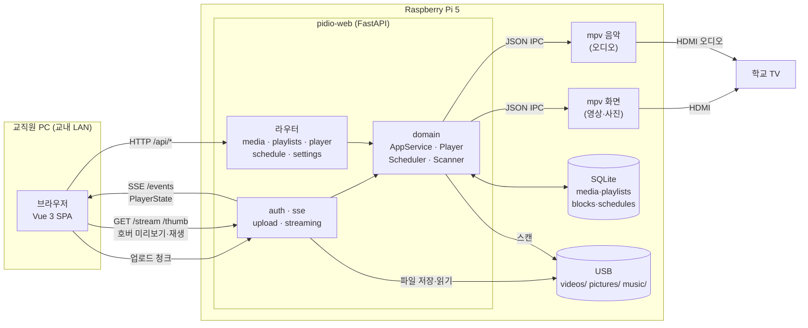
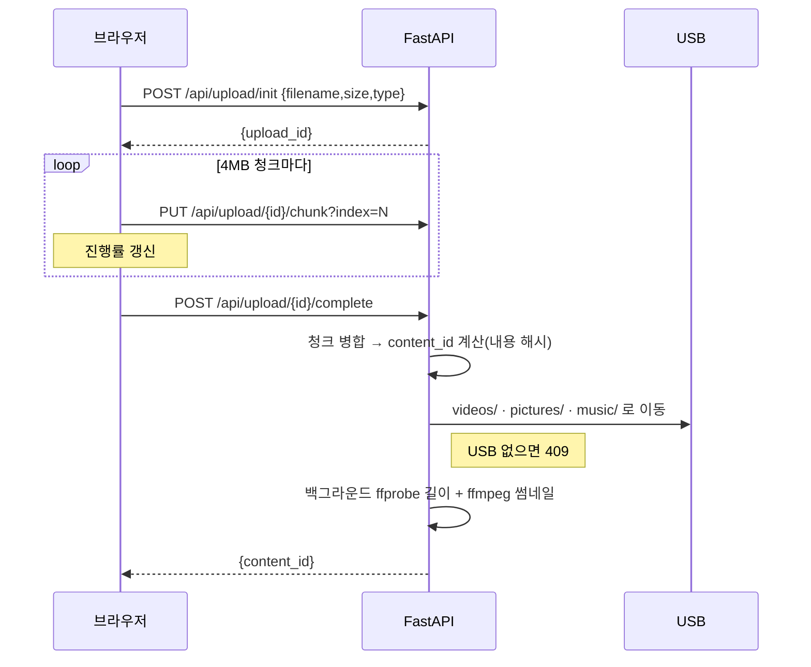
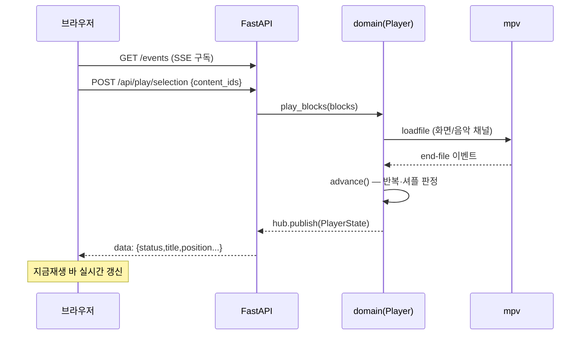
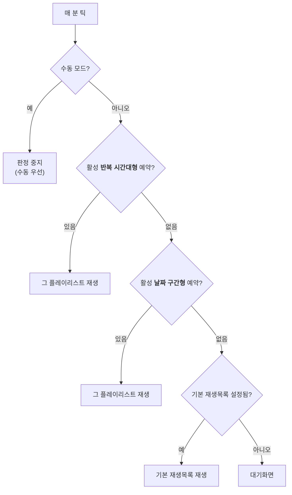

# Pidio

라즈베리파이5 기반 학교 미디어 플레이어 (찬우, 동제)

학교 TV에 연결된 Raspberry Pi 5에서 동영상·사진·음악을 재생하고, 교직원이 **교내 웹으로 원격 관리**(선택 재생, 반복/셔플, 혼합 플레이리스트, 예약 재생, 원격 업로드)하는 시스템.

- **TV**: 순수 재생 전용 (메뉴 UI 없음)
- **웹**: 리모컨 역할 (PC 화면 기준)
- **네트워크**: 교내 LAN 전용

---

## 기술 스택

- **백엔드**: Python 3.11+ (**uv** 관리) · FastAPI · SQLite(`sqlite3`, ORM 없음) · pytest
- **재생**: mpv 2인스턴스(화면·음악) JSON IPC 소켓 제어
- **미디어 처리**: ffmpeg / ffprobe (길이·썸네일)
- **프론트**: Vue 3 + Vite + vuedraggable → `backend/app/static`로 빌드
- **배포**: RPi5 / Raspberry Pi OS Lite (Bookworm 64-bit) / systemd

---

## 디렉토리

```
Pidio/
├─ backend/                    # uv 프로젝트 루트
│  ├─ app/
│  │  ├─ domain/               # 순수 로직 — mpv/USB 없이 테스트 가능
│  │  │  ├─ contracts.py       #   공통 계약: Block · PlayerState · PlayerController
│  │  │  ├─ db.py              #   SQLite 연결 · init_db (schema.sql)
│  │  │  ├─ identity.py        #   content_id 계산(크기 + 부분 해시)
│  │  │  ├─ media_repo.py      #   media 테이블 upsert/조회
│  │  │  ├─ playlist_repo.py   #   playlists · blocks · block_photos
│  │  │  ├─ scanner.py         #   USB 스캔 → media 갱신
│  │  │  ├─ scheduler.py       #   예약 판정(날짜 구간형 / 반복 시간대형)
│  │  │  ├─ player.py          #   재생 엔진(반복·셔플·자동전환)
│  │  │  ├─ mpv_ipc.py         #   mpv JSON IPC 클라이언트 (Pi 실행)
│  │  │  └─ service.py         #   AppService — 웹↔도메인 진입점
│  │  ├─ web/                  # FastAPI
│  │  │  ├─ main.py            #   create_app 팩토리 · 정적 SPA 서빙 · 백그라운드 루프
│  │  │  ├─ deps.py            #   도메인 조립(DB·Player·AppService) 싱글턴
│  │  │  ├─ auth.py            #   세션 인증(공용 비번)
│  │  │  ├─ sse.py             #   /events 실시간 상태 스트림
│  │  │  ├─ media_tools.py     #   ffmpeg/ffprobe 래퍼
│  │  │  ├─ upload.py          #   청크 업로드
│  │  │  ├─ streaming.py       #   Range 스트리밍 · 썸네일 서빙
│  │  │  ├─ serializers.py     #   media 응답 직렬화
│  │  │  ├─ background.py      #   부팅 스캔 · 분 단위 스케줄 틱
│  │  │  ├─ mpv_null.py        #   NullMpv — 개발용 무동작 mpv (Pi에서 MpvIpc로 교체)
│  │  │  └─ routers/           #   media · playlists · schedule · player · settings
│  │  └─ static/               # Vue 빌드 산출물 (자동 생성)
│  ├─ scripts/make_samples.py  # 개발용 샘플 미디어 생성(USB 없이 테스트)
│  └─ tests/                   # pytest
├─ frontend/                   # Vue 소스
│  └─ src/
│     ├─ api.js                #   fetch 래퍼 (401 처리)
│     ├─ store.js              #   전역 상태 + SSE 구독
│     ├─ upload.js             #   청크 업로드 클라이언트
│     ├─ format.js / mediaView.js / schedule.js / playlistModel.js   # 순수 유틸(vitest)
│     ├─ mock.js               #   서버 미연결 시 폴백 샘플
│     └─ components/           #   Login · NowPlaying · Library · MediaCard · HoverPreview
│                              #   Playlists · PlaylistDetail · MusicLane · ScheduleModal
│                              #   Uploader · Settings
└─ docs/
```

---

## 시작하기

### 사전 준비
- Python 3.11+ · Node 20+ · [uv](https://astral.sh/uv)
- ffmpeg (썸네일/길이): `winget install Gyan.FFmpeg`

### 설치
```bash
cd backend && uv sync          # ⚠ 작업 시작 전 매번 (git pull 후에도)
cd ../frontend && npm install
```

### 실행

**개발 모드** (터미널 2개)
```bash
cd backend && uv run uvicorn app.web.main:app --port 8000     # 터미널 1
cd frontend && npm run dev                                    # 터미널 2 → http://localhost:5173
```
Vite가 `/api`·`/stream`·`/thumb`·`/events`를 8000으로 프록시.
Windows에서는 `backend/run-dev.cmd`(샘플 미디어 + `dev.db`로 실행) · `frontend/run-dev.cmd` 런처로 바로 띄울 수 있음.

**빌드본 실행** (서버 하나만)
```bash
cd frontend && npm run build   # → backend/app/static/
cd ../backend && uv run uvicorn app.web.main:app --port 8000   # → http://localhost:8000
```

**로그인**: 공용 비밀번호 1개. **최초 로그인 시 입력한 비번이 그대로 설정**됩니다.
비번을 잊었으면 `backend/pidio.db`를 백업(이름 변경)하면 초기화됩니다.

### 테스트
```bash
cd backend && uv run pytest -q     # 백엔드 141 passed
cd frontend && npm run test        # 프론트 vitest 33 passed
```

### 환경 변수

| 변수 | 기본값 | 설명 |
|---|---|---|
| `PIDIO_MEDIA_ROOT` | `/media/usb` | USB 미디어 루트. 안에 `videos/` · `pictures/` · `music/` 필요. 개발 시 로컬 폴더(예: `sample_media`) 지정 |
| `PIDIO_DB` | `backend/pidio.db` | SQLite 파일 경로. 개발 시 `dev.db` 권장 |
| `PIDIO_UPLOAD_TMP` | (OS 임시폴더)`/pidio_upload` | 업로드 청크 임시 저장 폴더 |

> 테스트 모드(`create_app(testing=True)`)는 DB를 `:memory:`로 열고 백그라운드 루프를 띄우지 않음.

---

## 데이터 흐름

### 전체 구조



### 업로드



### 재생 & 실시간 상태



### 예약 판정 (분 단위 틱)



---

## 주요 API

모든 `/api/*`는 세션 쿠키 필요(로그인 제외). 자세한 계약은 [`docs/03_api_contract.md`](docs/03_api_contract.md).

| 분류 | 메서드 · 경로 | 설명 |
|---|---|---|
| 인증 | `POST /api/login` · `POST /api/logout` · `GET /api/me` | 로그인(최초 비번 설정)·로그아웃·세션 확인 |
| 실시간 | `GET /events` | SSE — PlayerState 실시간 스트림 |
| 미디어 | `GET /api/media?type=` · `PATCH /api/media/{content_id}` | 목록 조회 · 제목 수정 |
| 스트리밍 | `GET /stream/{content_id}` · `GET /thumb/{content_id}` | Range 재생(206) · 썸네일(jpeg) |
| 업로드 | `POST /api/upload/init` · `PUT /api/upload/{id}/chunk?index=` · `POST /api/upload/{id}/complete` | 청크 업로드 3단계 |
| 플레이리스트 | `GET·POST /api/playlists` · `GET·PUT·DELETE /api/playlists/{id}` · `POST /api/playlists/{id}/play` | CRUD · 재생 |
| 예약 | `PUT·DELETE /api/playlists/{id}/schedule` | 예약 설정/삭제 (겹치면 409) |
| 재생 제어 | `POST /api/play/selection` · `POST /api/player/{action}` | 선택 재생 · `action`=next/prev/pause/resume/stop/resume_auto |
| 재생 제어 | `POST /api/player/jump·repeat·shuffle·queue/reorder·queue/remove` | 점프·반복·셔플·큐 편집 |
| 설정 | `GET·PUT /api/settings` · `POST /api/settings/password` · `POST /api/rescan` | 설정 조회/저장 · 비번 변경 · USB 재스캔(미연결 409) |

---

## 데이터 모델

SQLite. 파일 실체는 항상 USB가 진실이고, DB는 부가정보·구성을 담음. 전체 정의는 [`backend/app/domain/schema.sql`](backend/app/domain/schema.sql).

| 테이블 | 핵심 컬럼 | 설명 |
|---|---|---|
| `media` | `content_id`(PK) · `media_type` · `original_name` · `custom_title` · `rel_path` · `duration` · `thumb_rel` · `available` | 미디어 부가정보. `content_id`는 내용 해시라 이름·이동에도 유지 |
| `playlists` | `id`(PK) · `name` · `repeat_mode` · `shuffle` | 블록들의 순서 있는 모음 |
| `playlist_blocks` | `id`(PK) · `playlist_id`→playlists · `position` · `kind` · `video_id`→media · `music_id`→media | 재생 단위. `kind`=`video`(동영상 1개) 또는 `slideshow`(사진들 + 선택 배경음악) |
| `block_photos` | `block_id`→blocks · `position` · `photo_id`→media · `duration_sec` | 슬라이드쇼 블록 안의 사진들(라인 순서·표시 시간) |
| `schedules` | `id`(PK) · `playlist_id`→playlists · `sched_type` · `start_dt`/`end_dt` · `weekdays`/`start_time`/`end_time` · `enabled` | 예약. `sched_type`=`date_range`(날짜 구간형) 또는 `weekly`(반복 시간대형) |
| `settings` | `key`(PK) · `value` | 전역 설정(기본 재생목록·사진 기본시간·비번 해시 등) |

외래키(`ON DELETE CASCADE`)로 플레이리스트를 지우면 블록·사진·예약이 함께 정리됨.

---

## 주요 개념

- **content_id** — 파일 식별자. 경로/이름이 아니라 **내용**(크기 + 앞뒤 1MB 해시)으로 계산.
  이름 변경·이동에도 커스텀 제목·썸네일·플레이리스트 참조가 유지됨.
- **블록(Block)** — 재생 단위. `video`(동영상 1개) 또는 `slideshow`(사진들 + 선택적 배경음악).
- **음악 라인 편집기** — 슬라이드쇼 블록을 "라인"으로 표현. 사진을 드래그해 다른 배경음악 라인으로 이동.
- **예약** — ① 날짜 구간형 ② 반복 시간대형(요일+시간). **반복 시간대형이 우선**, 없으면 기본 재생목록.
- **수동 우선** — 교직원이 수동 재생하면 스케줄 판정 중지, "자동 복귀" 버튼으로 해제.

---

## 트러블슈팅

- **cmd.exe에서 환경 변수** — `set PIDIO_MEDIA_ROOT=sample_media` 처럼 한 줄에 하나씩(따옴표·공백 없이). PowerShell은 `$env:PIDIO_MEDIA_ROOT="sample_media"`. 헷갈리면 `backend/run-dev.cmd` 사용.
- **USB 없이 테스트** — `cd backend && uv run python scripts/make_samples.py` 로 `sample_media/`(영상·음악·사진 샘플) 생성 → `PIDIO_MEDIA_ROOT=sample_media` 로 실행하면 부팅 스캔에 잡힘. (`run-dev.cmd`가 이 값을 이미 설정)
- **샘플/미디어가 안 보임** — `PIDIO_MEDIA_ROOT`는 **서버를 띄운 바로 그 터미널**에 설정돼야 함(다른 창에서 `set` 해도 반영 안 됨). 런처를 쓰면 확실.
- **ffmpeg를 찾을 수 없음** — `winget install Gyan.FFmpeg` 후 **새 터미널**에서 실행(또는 ffmpeg `bin`을 PATH에). 썸네일/길이 테스트가 skip되면 미설치 상태.
- **비밀번호 초기화** — `backend/pidio.db`(또는 `PIDIO_DB` 파일)를 이름 변경/백업 후 재시작 → 다음 로그인에서 입력한 비번이 새로 설정됨.
- **포트 충돌** — `--port 8001` 등으로 변경.
- **pytest가 정책 오류로 막힐 때** — `uv run python -m pytest -q` 로 실행.

---

## 문서

- [`docs/01_설계.MD`](docs/01_설계.MD) — 전체 설계(요구사항·데이터 모델·재생/예약 규칙)
- [`docs/02_구현.md`](docs/02_구현.md) — Phase별 구현 계획·태스크
- [`docs/03_api_contract.md`](docs/03_api_contract.md) — HTTP API 계약(v1)

---

## 진행 상황

| Phase | 내용 | 담당 | 상태 |
|---|---|---|---|
| 0 | 환경·리포·CLAUDE.md | 공동 | ✅ |
| 1 | 인터페이스 계약 고정 | 공동 | ✅ |
| 2~5 | 데이터·스캐너 / mpv IPC / 재생 엔진 / 스케줄러 | CW | ✅ |
| 6 | FastAPI 앱·인증·SSE | DJ | ✅ |
| 7 | 업로드·스트리밍·썸네일 | DJ | ✅ |
| 8 | API 라우터 (도메인 통합) | DJ | ✅ |
| 9 | Vue 프론트 | DJ | ✅ |
| 10 | systemd·배포·통합 E2E | 공동 | ⬜ (Pi 필요) |

**지금 동작하는 것** — 로그인/세션 · SSE 실시간 상태(`/events`) · 청크 업로드(실제 파일 저장) · Range 스트리밍/썸네일 · 미디어 목록 · 플레이리스트 CRUD · 예약(겹침 409) · 재생 제어 · 설정 · USB 재스캔 · 분 단위 스케줄 틱 · 전체 SPA(목록·넷플릭스 호버·플리 편집·예약 폼·설정).

**남은 것 (Phase 10 · Pi 필요)** — systemd 배포 · mpv 실시간 위치(현재 개발용 `NullMpv`, Pi에서 `MpvIpc`로 교체) · USB 마운트 감지 · 실기기 통합 E2E.

---

## 개발 규율

- **TDD**: 실패 테스트 → 최소 구현 → 통과 → 커밋
- 커밋 전 `uv run pytest -q` / 프론트 변경 시 `npm run build` 통과 확인
- 커밋 접두어: `feat` `fix` `test` `chore` `docs`
- **의존성은 오직 uv로** (`uv add`), `pyproject.toml`·`uv.lock` 반드시 커밋. pip 직접 사용 금지
- **소유 범위**: CW = `backend/app/domain` + 플레이어 / DJ = `backend/app/web` + `frontend`
- 계약(`contracts.py`·`03_api_contract.md`) 변경은 **상호 합의 후** 문서·코드 동시 갱신
- main 브랜치 직접 대형 변경 금지 — 기능 브랜치 후 머지
```
