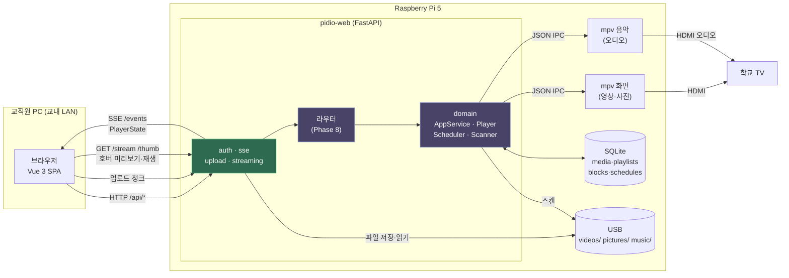
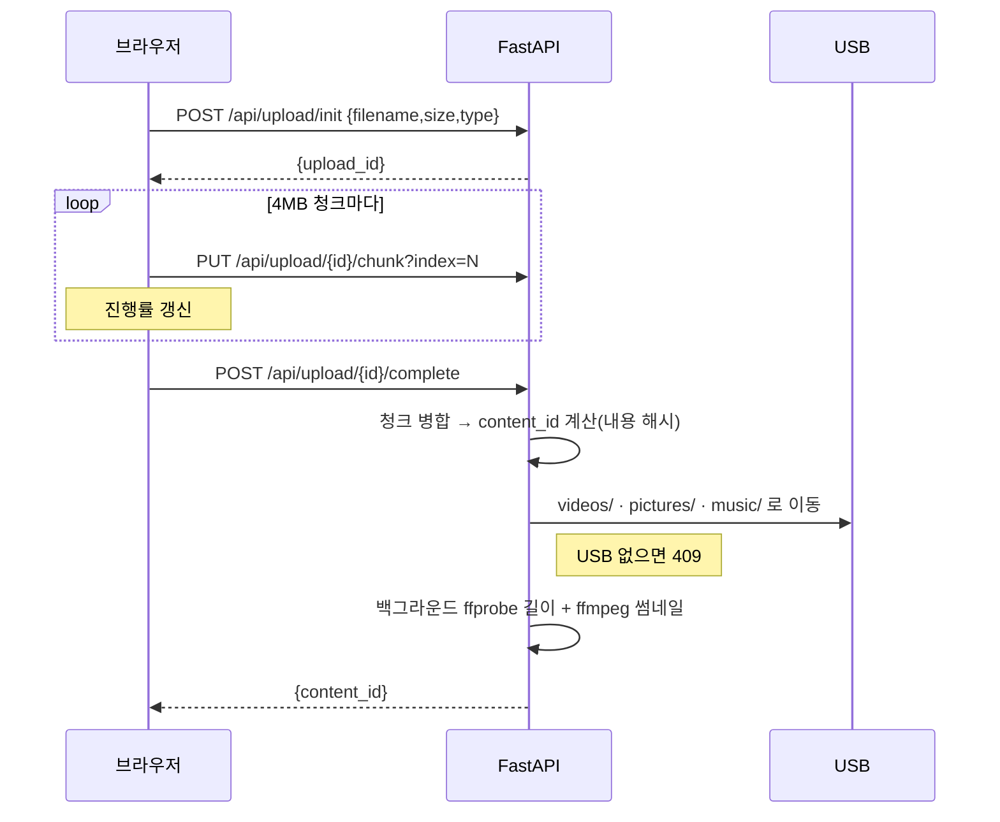
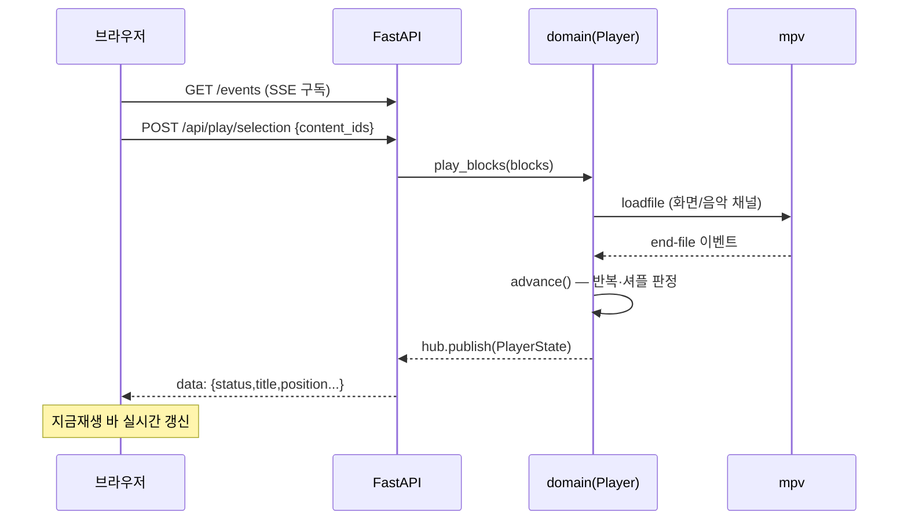
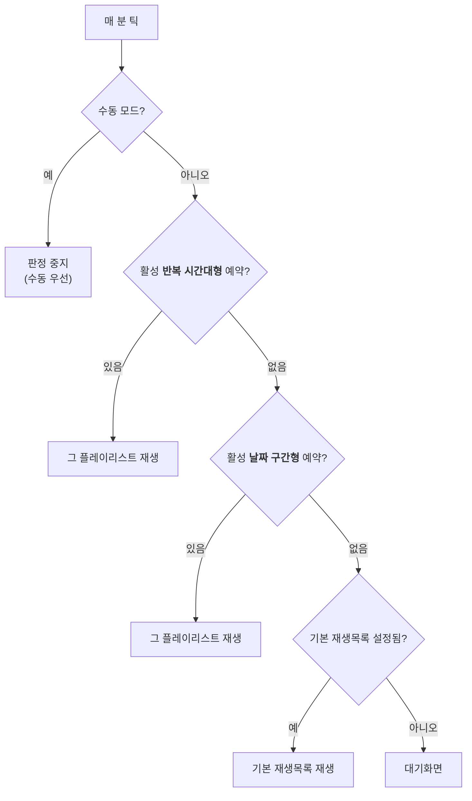

# Pidio

라즈베리파이5 기반 학교 미디어 플레이어 (찬우, 동제)

학교 TV에 연결된 Raspberry Pi 5에서 동영상·사진·음악을 재생하고, 교직원이 **교내 웹으로 원격 관리**(선택 재생, 반복/셔플, 혼합 플레이리스트, 예약 재생, 원격 업로드)하는 시스템.

- **TV**: 순수 재생 전용 (메뉴 UI 없음)
- **웹**: 리모컨 역할 (PC 화면 기준)
- **네트워크**: 교내 LAN 전용

---

## 기술 스택

- **백엔드**: Python 3.11+ (**uv** 관리) · FastAPI · SQLite(`sqlite3`, ORM 없음) · pytest
- **재생**: mpv 2인스턴스(화면·음악) JSON IPC 소켓 제어
- **미디어 처리**: ffmpeg / ffprobe (길이·썸네일)
- **프론트**: Vue 3 + Vite + vuedraggable → `backend/app/static`로 빌드
- **배포**: RPi5 / Raspberry Pi OS Lite (Bookworm 64-bit) / systemd

---

## 디렉토리

```
Pidio/
├─ backend/                 # uv 프로젝트 루트
│  ├─ app/
│  │  ├─ domain/            # 순수 로직 (CW 소유) — mpv/USB 없이 테스트 가능
│  │  │  └─ contracts.py    #   공통 계약: Block · PlayerState · PlayerController
│  │  ├─ web/               # FastAPI (DJ 소유)
│  │  │  ├─ main.py         #   create_app 팩토리 · 정적 SPA 서빙
│  │  │  ├─ deps.py         #   DB·설정 싱글턴
│  │  │  ├─ auth.py         #   세션 인증(공용 비번)
│  │  │  ├─ sse.py          #   /events 실시간 상태 스트림
│  │  │  ├─ media_tools.py  #   ffmpeg/ffprobe 래퍼
│  │  │  ├─ upload.py       #   청크 업로드
│  │  │  ├─ streaming.py    #   Range 스트리밍 · 썸네일 서빙
│  │  │  └─ adapters.py     #   ⚠ 임시 가짜 어댑터 (Phase 8에서 domain으로 교체)
│  │  └─ static/            # Vue 빌드 산출물 (자동 생성)
│  └─ tests/                # pytest
├─ frontend/                # Vue 소스 (DJ 소유)
│  └─ src/
│     ├─ api.js             #   fetch 래퍼 (401 처리)
│     ├─ store.js           #   전역 상태 + SSE 구독
│     ├─ upload.js          #   청크 업로드 클라이언트
│     ├─ format.js / mediaView.js / schedule.js / playlistModel.js   # 순수 유틸(vitest)
│     ├─ mock.js            #   ⚠ 샘플 데이터 (Phase 8 전 폴백)
│     └─ components/        #   Login · NowPlaying · Library · MediaCard · HoverPreview
│                           #   Playlists · PlaylistDetail · MusicLane · ScheduleModal
│                           #   Uploader · Settings
└─ docs/
```

---

## 시작하기

### 사전 준비
- Python 3.11+ · Node 20+ · [uv](https://astral.sh/uv)
- ffmpeg (썸네일/길이): `winget install Gyan.FFmpeg`

### 설치
```bash
cd backend && uv sync          # ⚠ 작업 시작 전 매번 (git pull 후에도)
cd ../frontend && npm install
```

### 실행

**개발 모드** (터미널 2개)
```bash
cd backend && uv run uvicorn app.web.main:app --port 8000     # 터미널 1
cd frontend && npm run dev                                    # 터미널 2 → http://localhost:5173
```
Vite가 `/api`·`/stream`·`/thumb`·`/events`를 8000으로 프록시.

**빌드본 실행** (서버 하나만)
```bash
cd frontend && npm run build   # → backend/app/static/
cd ../backend && uv run uvicorn app.web.main:app --port 8000   # → http://localhost:8000
```

**로그인**: 공용 비밀번호 1개. **최초 로그인 시 입력한 비번이 그대로 설정**됩니다.
비번을 잊었으면 `backend/pidio.db`를 백업(이름 변경)하면 초기화됩니다.

**업로드 테스트**: USB 루트를 지정해서 실행 (기본값 `/media/usb`은 Pi 기준)
```bash
PIDIO_MEDIA_ROOT=C:/temp/usb uv run uvicorn app.web.main:app --port 8000
# C:/temp/usb 안에 videos·pictures·music 폴더 필요. 없으면 409(USB 미연결)
```

### 테스트
```bash
cd backend && uv run pytest -q     # 백엔드 21 passed
cd frontend && npm run test        # 프론트 vitest 33 passed
```

---

## 데이터 흐름

### 전체 구조



> 🟢 = DJ 완료(Phase 6·7) · 🟣 = Phase 8 / CW 도메인 대기

### 업로드 (Phase 7 · 실동작)



### 재생 & 실시간 상태 (Phase 8 연결 예정)



### 예약 판정 (분 단위 틱)



---

## 주요 개념

- **content_id** — 파일 식별자. 경로/이름이 아니라 **내용**(크기 + 앞뒤 1MB 해시)으로 계산.
  이름 변경·이동에도 커스텀 제목·썸네일·플레이리스트 참조가 유지됨.
- **블록(Block)** — 재생 단위. `video`(동영상 1개) 또는 `slideshow`(사진들 + 선택적 배경음악).
- **음악 라인 편집기** — 슬라이드쇼 블록을 "라인"으로 표현. 사진을 드래그해 다른 배경음악 라인으로 이동.
- **예약** — ① 날짜 구간형 ② 반복 시간대형(요일+시간). **반복 시간대형이 우선**, 없으면 기본 재생목록.
- **수동 우선** — 교직원이 수동 재생하면 스케줄 판정 중지, "자동 복귀" 버튼으로 해제.

---

## 진행 상황

| Phase | 내용 | 담당 | 상태 |
|---|---|---|---|
| 0 | 환경·리포·CLAUDE.md | 공동 | ✅ |
| 1 | 인터페이스 계약 고정 | 공동 | ✅ 초안 (합의 대기) |
| 2~5 | 데이터·스캐너 / mpv IPC / 재생 엔진 / 스케줄러 | **CW** | ⬜ |
| 6 | FastAPI 앱·인증·SSE | **DJ** | ✅ |
| 7 | 업로드·스트리밍·썸네일 | **DJ** | ✅ |
| 8 | API 라우터 (도메인 통합) | **DJ** | ⏳ CW Phase 2~5 대기 |
| 9 | Vue 프론트 | **DJ** | ✅ (D-1~D-7) |
| 10 | systemd·배포·통합 E2E | 공동 | ⛔ Pi 필요 |

### 지금 실제로 동작하는 것
로그인/세션 · SSE 채널(`/events`) · **청크 업로드**(실제 파일 저장) · Range 스트리밍/썸네일 서빙 · SPA 전체 UI(목록·넷플릭스 호버·플리 편집·예약 폼·설정)

### Phase 8 대기 중 (배선은 완료)
미디어 목록(`/api/media`) · 플레이리스트 저장(`/api/playlists`) · 재생 제어(`/api/player/*`) · 예약/설정 저장

> 그 전까지 백엔드는 `app/web/adapters.py`(가짜 어댑터), 프론트는 `src/mock.js`(샘플 데이터)로 폴백.
> **실제 라우터가 생기면 코드 수정 없이 자동 전환**되도록 구성돼 있음.

---

## 개발 규율

- **TDD**: 실패 테스트 → 최소 구현 → 통과 → 커밋
- 커밋 전 `uv run pytest -q` / 프론트 변경 시 `npm run build` 통과 확인
- 커밋 접두어: `feat` `fix` `test` `chore` `docs`
- **의존성은 오직 uv로** (`uv add`), `pyproject.toml`·`uv.lock` 반드시 커밋. pip 직접 사용 금지
- **소유 범위**: CW = `backend/app/domain` + 플레이어 / DJ = `backend/app/web` + `frontend`
- 계약(`contracts.py`·`03_api_contract.md`) 변경은 **상호 합의 후** 문서·코드 동시 갱신
- main 브랜치 직접 대형 변경 금지 — 기능 브랜치 후 머지
